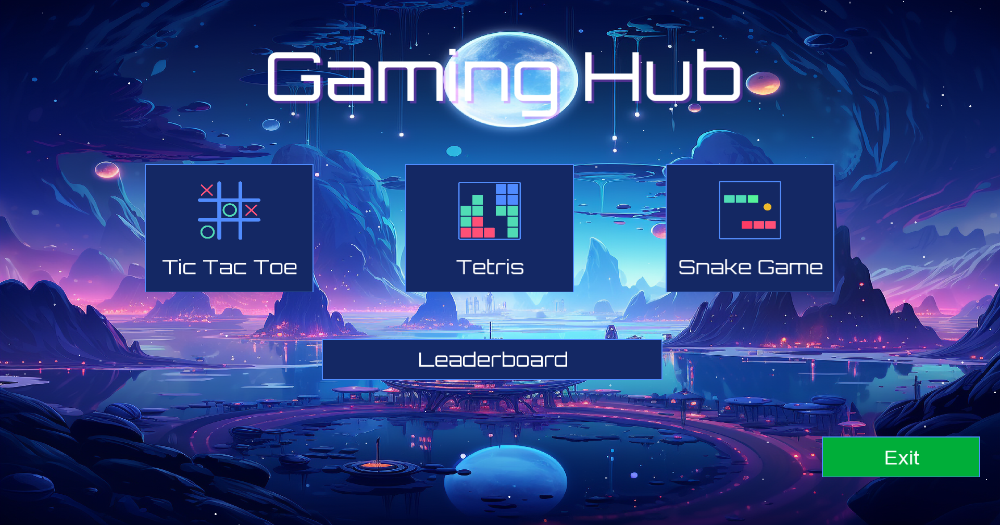
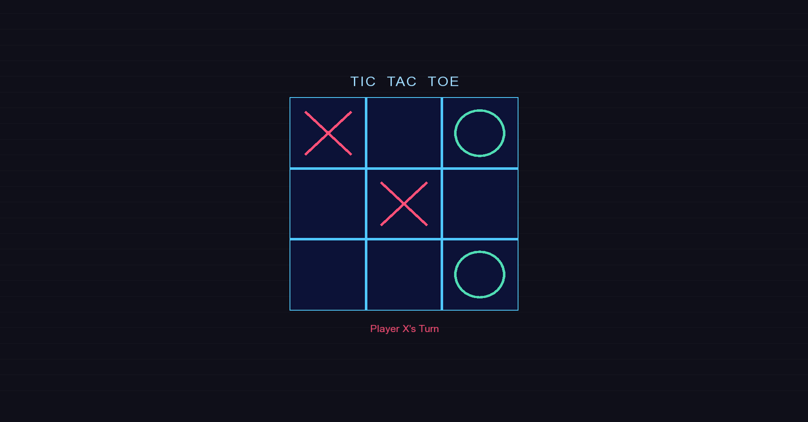
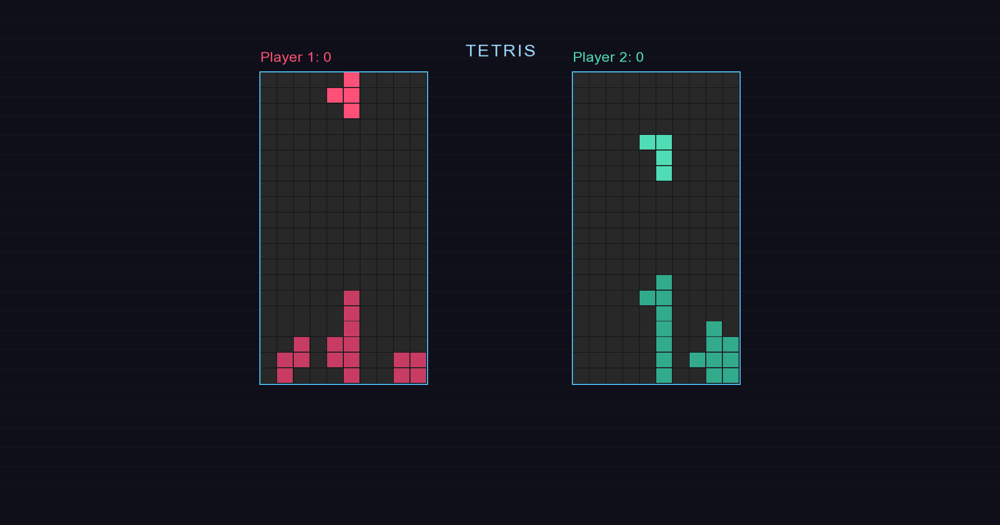
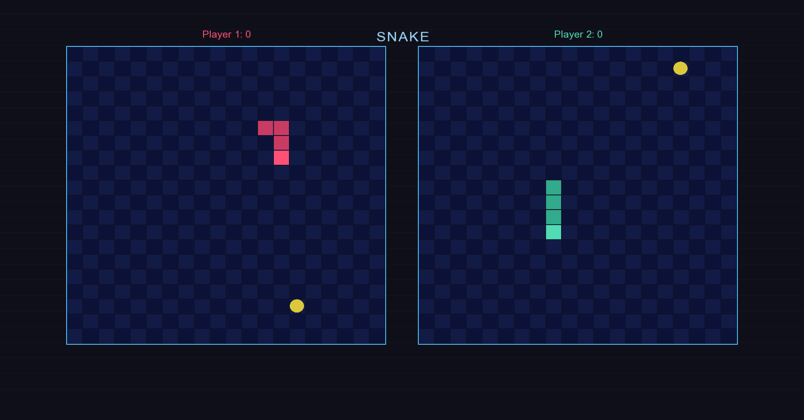

# Gaming Hub

A graphical C++ gaming hub built with SFML, featuring 3 classic games that can be accessed from a single interactive hub.

---

## Games

- Snake
- Tetris
- Tic-Tac-Toe

---

## Features

- Graphical window and rendering via SFML
- Unified menu to launch any game from one place
- Leaderboard to track and display high scores
- Reusable button component for consistent UI across all the games

---

## Screenshots

Main Hub


Tic Tac Toe


Tetris


Snake


---

## Project Structure

```
Gaming-Hub/
├── Fonts/            # Fonts used in the project
├── img/              # Images used in the project
|    ├── galaxy.jpg
|    ├── SS_Snake.png
|    ├── SS_Tetris.png
|    ├── SS_Tic.png
|    └── SS_Hub.png
├── main.cpp          # Starting point, Main Hub
├── Header.h          # All the declarations
├── Button.cpp        # Reusable SFML button component
├── Leaderboard.cpp   # Score tracking and display
├── Snake.cpp         # Snake game logic
├── Tetris.cpp        # Tetris game logic
└── TicTacToe.cpp     # Tic-Tac-Toe game logic
```

---

## How to Run

### Requirements
- C++ compiler (g++ or MSVC)
- SFML 3.x installed and linked

### Compile & Run (g++)

```bash
g++ main.cpp Button.cpp Leaderboard.cpp Snake.cpp Tetris.cpp TicTacToe.cpp -o GamingHub -lsfml-graphics -lsfml-window -lsfml-system
./GamingHub
```

---

## Built With


